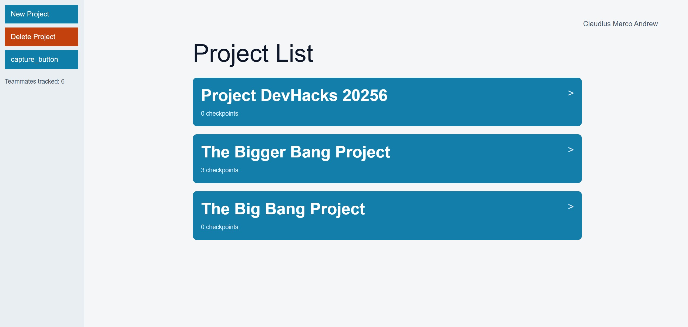
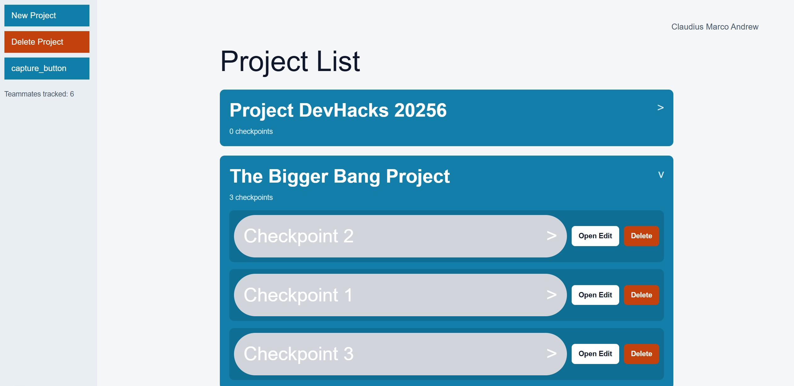
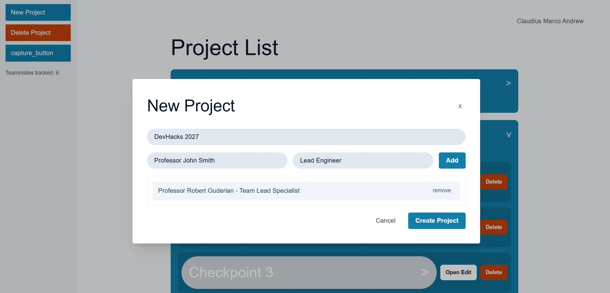
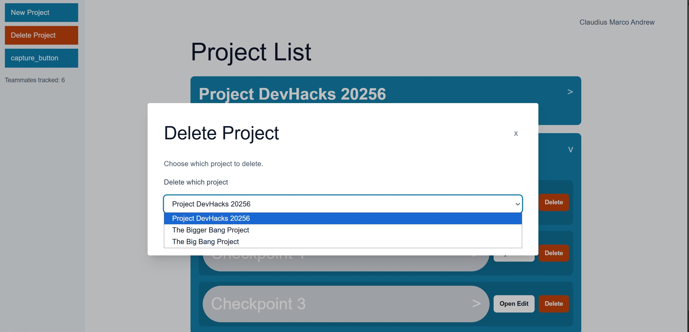
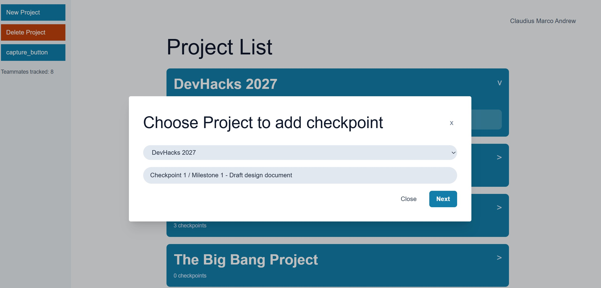
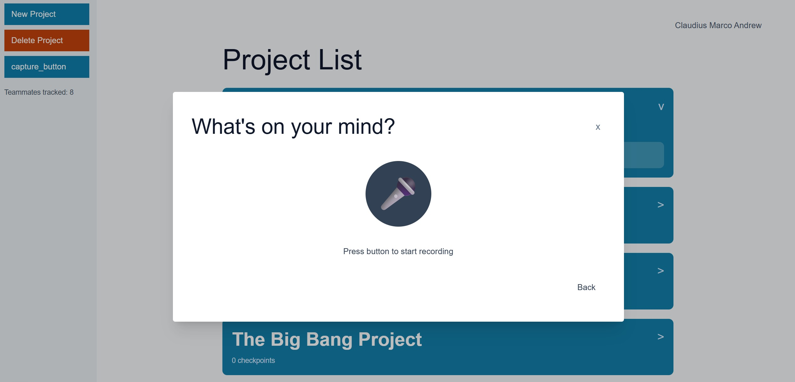
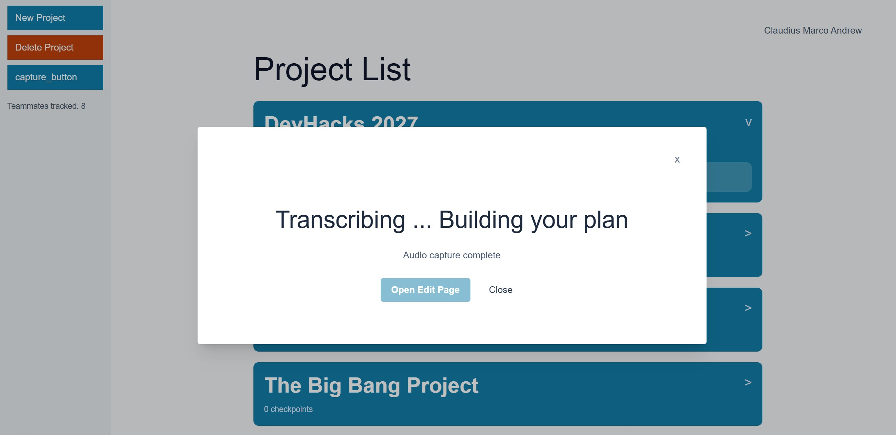
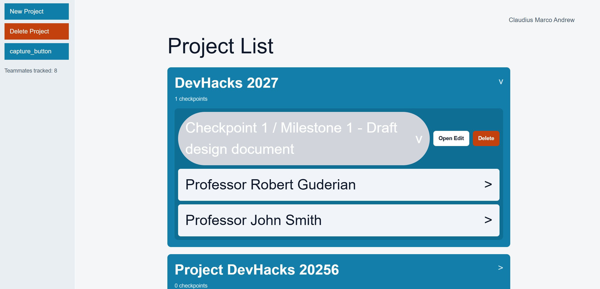
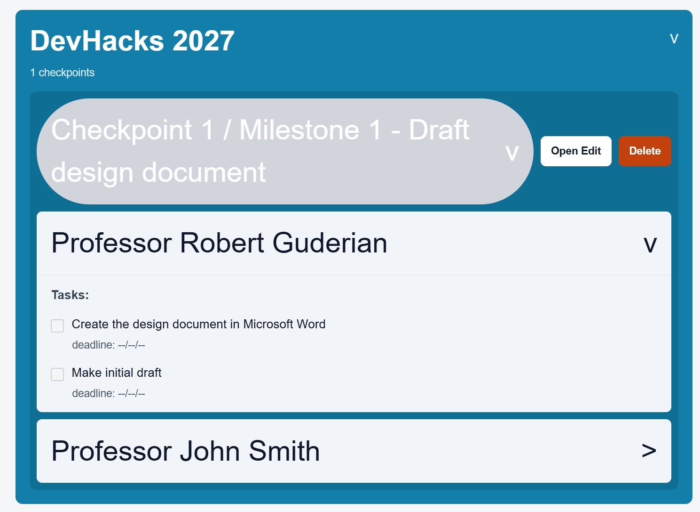
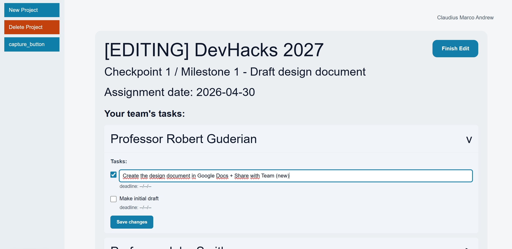

# LeadSpeaker

LeadSpeaker is a checkpoint management app where team leads and managers create projects, track teammates, and convert spoken updates into structured task lists with AI.

## Inspiration

Have you ever gotten frustrated about missing tasks or not listing what to do? Many people naturally plan while speaking, because saying ideas out loud is often easier and faster than writing everything down. LeadSpeaker uses AI to convert what you say into structured tasks, helping teams capture plans without losing details.

## What It Does

LeadSpeaker is a checkpoint management app where team leads and managers can create projects with teammate lists, capture voice updates, and generate tasks/to-do items for selected checkpoints.

LeadSpeaker includes AI transcription and structured extraction features to make task planning easier and less tedious.

## How We Built It

- Frontend: Next.js
- Backend: Node.js + OpenAI Node SDK
- Voice capture: `MediaRecorder`
- Data output: JSON file I/O

## What We Learned

- Linking records to the frontend is not easy when incoming data is unpredictable
- Naming and string normalization are critical when storing user-derived input
- Coming from React Native, we learned a lot about Next.js server/client boundaries and routing
- AI integration is powerful, but reliability and mapping logic are essential

## Demo (Screenshots)

### 1) Home and Project Management

Main dashboard where users can view projects and start core actions.

Expanded project card showing checkpoints and teammate task sections.

Popup flow used to create a new project and assign teammates.

Confirmation flow to safely remove a project from the list.

### 2) Voice Capture Flow

First capture step where the user selects the target project/checkpoint context.

Recording stage where spoken updates are captured from the microphone.

Processing stage that sends captured audio for AI transcription and extraction.

### 3) Milestone and Task Output

Newly created milestone appears in the selected project's checkpoint list.

Extracted tasks are mapped to teammates and displayed under the milestone.

Task text can be reviewed and updated inline for quick corrections.

## Challenges We Ran Into

- Ensuring JSON file writes happen consistently
- Name mapping issues from transcription variance (extra surnames and slight mismatches)
- Frontend bugs around checkpoint creation, edit navigation, and strict data flow to storage

## What's Next for LeadSpeaker

- Tighten routing and workflow reliability
- Make the current program safer and more deployable
- Keep improving both UI and backend while exploring more useful AI-driven features
